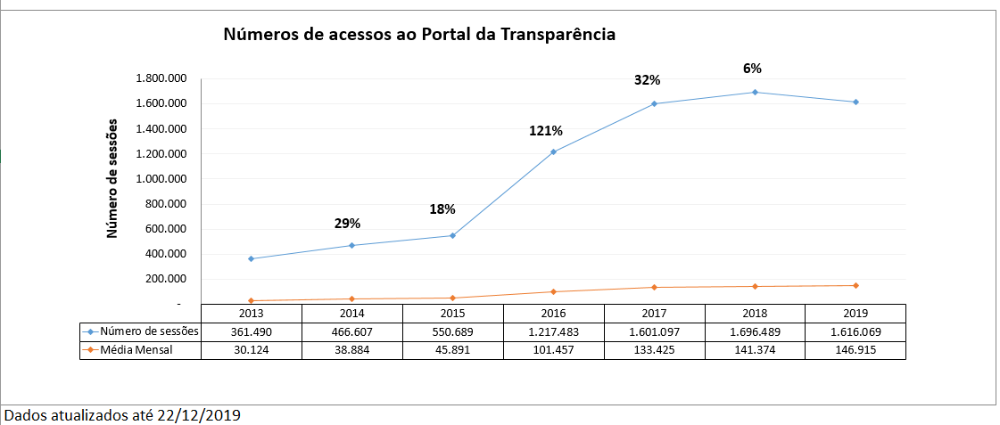

__1) O Portal da Transparência e a seção de Dados Abertos do Governo de Minas Gerais sempre foram unificados num mesmo portal? Caso não, quando e por quais razões ocorreu esta integração?__

O Portal de Transparência e o Portal de Dados Abertos são ferramentas de transparência que não se encontram integradas em uma mesma url.  No caso do Estado de Minas Gerais o Portal de Dados Abertos apenas encontra-se incorporado no Portal de transparência.

* Portal da Transparência (http://www.transparencia.mg.gov.br/)
* Portal de Dados Abertos (http://www.transparencia.dadosabertos.mg.gov.br/)

__2) Quais as vantagens, benefícios vocês percebem neste modelo de unificação do Portal da Transparência com a seção de Dados Abertos?__

__3) Vocês percebem desvantagens, problemas, dificuldades neste modelo unificado de portais? Se sim, quais?__

__4) Qual a plataforma tecnológica do atual Portal da Transparência? (CMS; bancos de dados; ferramentas de extração, transformação e carregamento (ETL); relatórios/visualização de dados etc.)__

O Portal de Transparência utiliza-se como gerenciador de conteúdo Joomla e a sua atualização (carregamento) é realizada por meio de ETL.

__5)      Quais parâmetros técnicos motivaram a escolha da atual plataforma utilizada por vocês?__

__6)      Qual a forma de disponibilização do Portal e armazenamento dos dados (solução própria ou contratada/nuvem ou servidor dedicado)?__

Tanto no Portal da Transparência quanto no Portal de Dados Abertos a hospedagem dos sistemas é feita em ambiente dedicado de baixa plataforma.
A PRODEMGE é a empresa contratada para prestar o serviço de hospedagem o qual disponibilizada toda infraestrutura de Data Center e equipamentos. O serviço ainda inclui a infraestrutura física necessária para a produção continuada dos sistemas, com servidores de propriedade da própria empresa dedicados ao serviço.

Estão incluídos o fornecimento dos sistemas operacionais para servidores de aplicação, banco de dados e os procedimentos de operação padronizados de backup, recuperação de dados e de sistemas, assim como a estrutura de suporte técnico operacional, necessários para o processamento do serviço. Inclui também os procedimentos e a estrutura de suporte técnico operacional, necessários para o processamento do serviço.

__7)      O Portal da Transparência e a seção de Dados Abertos operam ambos na plataforma CKAN ou a seção de Dados Abertos funciona "embutida" na estrutura do Portal da Transparência?__

Apenas o Portal de Dados Abertos opera na plataforma CKAN. Conforme mencionado na questão 1 o Portal de Dados Abertos encontra-se incorporado no Portal da Transparência.

__8)      Como foi em linhas gerais o processo de desenvolvimento do novo Portal da Transparência de Minas Gerais? Em termos de:__

__a. Duração do projeto__

__b. Equipe envolvida (própria da CGE; externa, mas do Governo do Estado; empresas ou profissionais externos ao Governo etc.)__

__c. Recursos financeiros empregados__

Foi celebrado o contrato com a PRODEMGE, empresa responsável pela reestruturação do Portal de Transparência no valor total de R$ 1.049.552,00 (um milhão, quarenta e nove mil, quinhentos e cinquenta e dois reais com vigência de 12 meses. No entanto, foi necessário a prorrogação por mais 12 meses. Nesse sentido, a entrega final do Portal encerrou-se em novembro de 2017.
Importante destacar que durante a execução do contrato foi preciso realizar supressão de valores, havendo uma redução total de R$210.942,00 (duzentos e dez mil, novecentos e quarenta e dois reais).

As equipes envolvidas na execução do projeto foram servidores da própria CGE (especificação e homologação) e servidores da PRODEMGE (construção e desenvolvimento da ferramenta).
A reestruturação do Portal, bem como a sua manutenção preventiva e corretiva foram de responsabilidade de servidores da CGE (especificação e homologação) e servidores da PRODEMGE (construção, execução e desenvolvimento), empresa de tecnologia da informação vinculada ao governo estadual.

__9) Qual o volume atual de acessos/visitas ao Portal da Transparência? E apenas da seção de Dados Abertos?__

