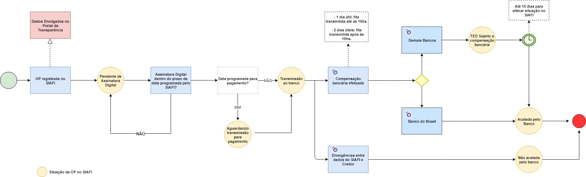

# Registro dos Valores efetivamente pago no Portal de Transparência

Para aprofundar a discussão sobre a forma como os dados são divulgados no Portal de Transparência do Estado de Minas Gerais, apresentamos a seguir as alterações implementadas na *Consulta de Despesas* com a finalidade de tornar a informação mais consistente e transparente para a sociedade.

No Estado de Minas Gerais, o estágio de pagamento divide-se em pelo menos quatro etapas, conforme descrito a seguir:

- Etapa 1:	Ao registrar a Ordem de Pagamento (OP) no SIAFI (Sistema Integrado de Administração Financeira) o operador financeiro programa a data do pagamento.

- Etapa 2:	A OP fica pendente para transmissão ao banco até que o Ordenador de Despesa autorize o seu pagamento.

- Etapa 3: Após a assinatura da OP pelo ordenador de despesa, a OP é transmitida para o banco, obedecendo sempre o cronograma de pagamento informado na etapa 1. A transmissão da OP a rede bancária está condicionada a assinatura do Ordenador de Despesa, podendo ser reprogramada a qualquer momento sem aviso prévio;

- Etapa 4: A compensação bancária na conta do credor é efetuada em até 48 horas. Esse fato depende do horário que os arquivos são enviados ao banco (1 dia útil para a transmissão realizada até às 15hs; 2 dias úteis para a transmissão realizada após às 15hs).

O Portal de Transparência até xxxxx apresentava os dados relativos a OP no momento do registro no SIAFI (etapa 1). Assim, o Portal divulgava uma despesa como paga, mas que ainda não havia percorrido todas as etapas de pagamento, o que gerava transtorno para a administração e para os credores.

Assim, visando apresentar os dados mais próximos da realidade, a partir do dia xxxx, o Portal de Transparência passa a apresentar o pagamento das OPs no momento da compensação bancária (etapa 4), respeitado o prazo de atualização de D+1 estabelecido pelo Decreto Federal n° 7.185, de 2010.

A partir dessa alteração, a coluna Valor Pago bem como o formulário de detalhamento do pagamento passou a apresentar o pagamento efetivo de uma determinada OP, na data em que a compensação bancária ocorreu.

Essa atualização na forma de divulgação dos dados atente plenamente a Lei de Transparência (Lei Complementar n° 131/2009) que determina que as informações devem ser divulgadas em tempo real.

**Nota 1:**
Novo conceito Valor Pago: Valor pago pelo Estado de Minas Gerais até a data de atualização da base de dados, estando o efetivo pagamento sujeito a compensação bancária.

**Nota 2:**
A execução da despesa orçamentária pública transcorre em três estágios, conforme previsto na [Lei nº 4.320/1964](http://www.planalto.gov.br/ccivil_03/leis/l4320.htm): empenho, liquidação e pagamento.

O [empenho](http://www.planalto.gov.br/ccivil_03/leis/l4320.htm) representa o primeiro estágio da despesa orçamentária. É registrado no momento da contratação do serviço, obra, aquisição do material ou bem. Nessa etapa o governo reserva o dinheiro que será pago quando o bem for entregue ou o serviço concluído. Isso ajuda o governo a organizar os gastos pelas diferentes áreas do governo, evitando que se gaste mais do que foi planejado.

A [liquidação](http://www.planalto.gov.br/ccivil_03/leis/l4320.htm) é o segundo estágio da despesa orçamentária. É quando se verifica que o governo recebeu aquilo que comprou ou contratou. Ou seja, quando se confere que o bem foi entregue corretamente ou que a etapa da obra foi concluída como acordado.

O [pagamento](http://www.planalto.gov.br/ccivil_03/leis/l4320.htm) da despesa refere-se ao terceiro estágio. Se estiver tudo certo com as fases anteriores, o governo pode fazer o pagamento, repassando o valor ao prestador de serviço contratado.
